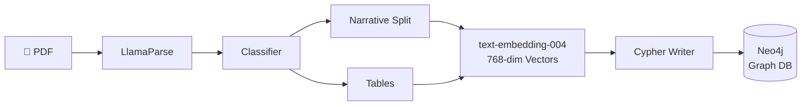

<div align="center">

# RootAlpha

**Multi-Agent GraphRAG Platform for Financial Root-Cause Analysis**

[](https://python.org)
[](https://langchain-ai.github.io/langgraph/)
[](https://neo4j.com)
[](https://cloud.google.com/vertex-ai)
[](https://docker.com)
[](LICENSE)

Ingests dense quarterly reports → builds a causal knowledge graph → returns numerically-verified root-cause analysis in under **15 seconds**.

</div>

---

## Overview

### The Problem

Every quarter, financial analysts and investors face the same grind: a company publishes a 120-page report — Management Discussion, Risk Factors, Footnotes, Financial Statements — and somewhere buried across those sections is the real story. Why did gross margin compress 4 points? Was it raw material costs, a product mix shift, or a one-time write-down? Answering that requires jumping between sections, cross-referencing numbers, and manually tracing the chain of events that led to the outcome.

That process routinely takes **hours per report** — and it breaks down entirely when you're tracking multiple companies across multiple quarters.

Generic AI tools make it worse, not better. They confidently cite numbers that aren't in the document, miss causal connections that span sections, and give no way to verify where an answer came from.

---

### What RootAlpha Does

RootAlpha reads a quarterly report the way a senior analyst would — except in seconds, not hours. It understands that a revenue miss isn't just a number: it's the downstream effect of a supplier disruption, a regional slowdown, or a currency headwind mentioned three sections earlier. It maps those cause-and-effect relationships explicitly, so every answer it gives can be traced back to a specific passage or data point in the source document.

More importantly: **if a number can't be verified against the document, RootAlpha won't say it.** It hard-blocks ungrounded claims and tells you so — rather than presenting a confident-sounding hallucination.

---

### Who It's For

| Persona | Use Case |
|---|---|
| 📊 **Buy-side / Sell-side Analysts** | Rapid root-cause drill-down on earnings misses, margin shifts, and guidance changes across a portfolio of companies |
| 🏦 **Investment Research Teams** | Automated first-pass analysis on newly released 10-Qs and 10-Ks before human review |
| ⚖️ **Risk & Compliance Officers** | Systematic extraction and tracking of disclosed risk factors and their financial impact across quarters |
| 🔍 **Due Diligence Teams** | Cross-document causal mapping during M&A or credit underwriting — tracing how macro events flow through to balance sheet metrics |

---

### Pain Points Solved

**→ Hours of manual cross-referencing, eliminated**
Drop in a quarterly report and ask a plain-English question. RootAlpha surfaces the answer — with the source evidence — in under 15 seconds.

**→ Hallucinated numbers, blocked**
A built-in grounding check verifies every numeric claim against the retrieved document context before the answer is returned. Unverified claims trigger a safe fallback, not a confident lie.

**→ Disconnected insights, connected**
Most tools treat a report as a pile of text chunks. RootAlpha builds a causal graph — linking metrics to events, events to macro conditions, and conditions to disclosed risks — so you can ask *why* something happened, not just *what* happened.

**→ Opaque AI reasoning, made auditable**
Every answer traces back to specific sections and passages in the source document. No black box. No "trust me."

---

## How It Works

RootAlpha runs in two stages. First, a **graph ingestion pipeline** parses the raw PDF, classifies its sections, and constructs a structured knowledge graph in Neo4j — preserving not just the text, but the relationships between entities (companies, metrics, events, risk factors). Second, a **LangGraph query agent** receives a natural-language question, retrieves the most relevant context from that graph, enforces a quality gate, verifies numeric grounding, and synthesizes a final answer.

---

## Architecture

### ☁️ Cloud Architecture

A highly-available GCP deployment with containerized microservices, secure VPC networking, and Cloud Storage as the PDF landing zone.


---

<details>
<summary><strong>📄 Ingestion Pipeline</strong> — click to expand</summary>
<br>

Parses PDFs → classifies sections → chunk-embeds narratives and tables → writes structured graph nodes to Neo4j.



</details>

<details>
<summary><strong>🤖 Query Agent — LangGraph State Machine</strong> — click to expand</summary>
<br>

A cyclic, self-correcting workflow with a strict quality gate and numeric grounding check enforced before any answer is returned.


</details>

---

## Stack

| Layer | Technology |
|---|---|
| **Language** |  |
| **API Server** |   |
| **Agent Orchestration** |   |
| **Graph Database** |  — APOC · Vector Index · `VectorCypherRetriever` |
| **Inference & Embeddings** |  — `gemini-2.5-flash` · `text-embedding-004` (768-dim) |
| **PDF Parsing** |  — layout classification · table isolation |
| **Object Storage** |  — PDF landing zone |
| **Evaluation** |   |
| **Observability** |   |
| **Containers** |   |
| **Testing & Linting** |    |

---

## Evaluation

RootAlpha enforces anti-hallucination at the numeric level. If fewer than **40%** of generated numeric claims are traceable to retrieved context, the system hard-blocks and returns a safe fallback.

| Metric | Target | Strategy | Status |
|---|---|---|---|
| Numeric Grounding Ratio | `> 0.90` | Tables stored as dedicated graph nodes preserving row/col structure | ✅ Passed |
| Context Relevance (GraphRAG) | `> 0.85` | Hybrid Cypher with neighbor expansion — `MacroEvent → IMPACTED → Metric` | ✅ Passed |
| Graph Traversal Latency | `< 3.00s` | Cypher index on Ticker & Document ID | ⚠️ Optimizing |
| Quality Gate Rejection Rate | `< 5.0%` | Strict system prompt engineering + query expansion | ✅ Passed |

---

## Setup

> **Prerequisites:** Docker, `gcloud` CLI, a GCP project with Vertex AI enabled, and a LlamaParse API key.

<details open>
<summary><strong>Option A — Docker (Recommended)</strong></summary>
<br>

```bash
# 1. Clone
git clone https://github.com/your-username/financial-root-cause-analysis.git
cd financial-root-cause-analysis

# 2. Configure environment
cp .env.example .env
# → Set GCP_PROJECT_ID and LLAMA_PARSE_API_KEY in .env

# 3. Authenticate GCP
gcloud auth application-default login --project development-498315

# 4. Start all services (mounts ADC credentials from host)
docker-compose up --build
```

| Service | URL |
|---|---|
| LangGraph Agent UI | http://localhost:8080 |
| FastAPI Ingestion Docs | http://localhost:8000/docs |
| Neo4j Browser | http://localhost:7474 — `neo4j` / `password123` |

</details>

<details>
<summary><strong>Option B — Native Python</strong></summary>
<br>

```bash
# 1. Install uv and sync dependencies
curl -LsSf https://astral.sh/uv/install.sh | sh
uv sync && source .venv/bin/activate

# 2. Run a local Neo4j instance
docker run --name rootalpha-neo4j \
    -p 7474:7474 -p 7687:7687 \
    -e NEO4J_AUTH=neo4j/password123 \
    -e NEO4J_PLUGINS='["apoc"]' \
    -d neo4j:5.24.0-community

# 3. Authenticate GCP
gcloud auth application-default login --project development-498315

# 4. Start the ingestion server
python -m ingestion.api.run

# 5. Start the LangGraph agent
langgraph dev
```

</details>

---

## Design Decisions

**Graph DB over Vector Store** — Replacing Pinecone with Neo4j increased ingestion latency but enabled explicit causal relationship traversal (`CAUSED`, `IMPACTED`, `DEPENDS_ON`), significantly reducing hallucinations in company structure and event-chain queries.

**LangGraph over Linear Chains** — Higher boilerplate, but the state-machine model allows Quality Gate nodes to intercept ungrounded outputs mid-flight and force retrieval replanning — impossible with standard sequential pipelines.

**Future Work** — Parallelize chunk-vector search and graph expansion in retrieval nodes (targeting −1.5s latency). Evaluate local quantized models (Llama 3) as Vertex AI fallbacks to reduce cost and external dependency.