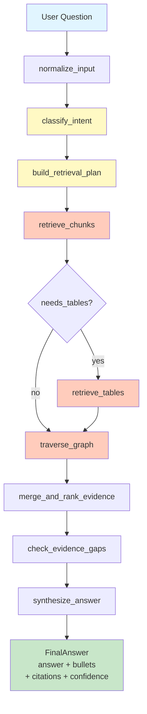
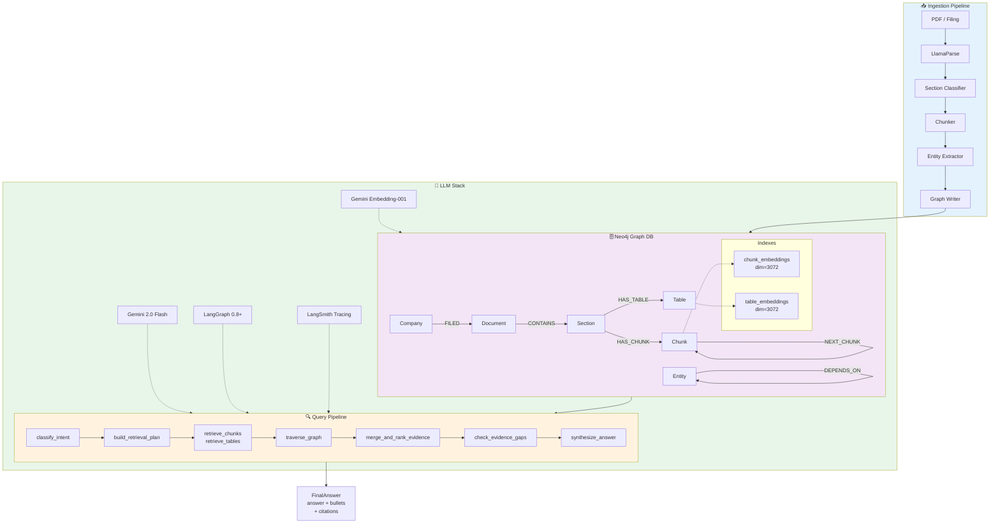

# RootAlpha — Financial GraphRAG Platform

> A graph-augmented retrieval system for deep financial document analysis.  
> Combines **Neo4j knowledge graph**, **vector search**, and **Gemini LLMs** into a multi-hop reasoning pipeline orchestrated with **LangGraph**.

---

## Table of Contents

- [Overview](#overview)
- [Architecture](#architecture)
- [Project Structure](#project-structure)
- [Graph Schema](#graph-schema)
- [Query Pipeline](#query-pipeline)
- [Setup](#setup)
- [Environment Variables](#environment-variables)
- [Usage](#usage)
  - [CLI Query](#cli-query)
  - [LangSmith Studio](#langsmith-studio)
  - [Document Ingestion](#document-ingestion)
  - [RAGAS Evaluation](#ragas-evaluation)
- [Evaluation Metrics](#evaluation-metrics)
- [Development](#development)

---

## Overview

RootAlpha answers financial questions (revenue comparisons, risk factors, causal analysis, trend tracking) by reasoning over a **knowledge graph** built from SEC filings and earnings documents.

It is **not** a generic RAG system. Every query goes through:

1. **Intent classification** — maps the question to a retrieval strategy
2. **Retrieval planning** — decides how many chunks/tables to fetch and whether to traverse the graph
3. **Hybrid retrieval** — semantic vector search over chunks and tables in parallel
4. **Graph traversal** — multi-hop expansion via causal and structural edges
5. **Evidence synthesis** — grounded answer generation with citations and confidence scoring

---

## Architecture

### Query Pipeline Flow



### System Architecture



---

## Project Structure

```
RootAlpha/
│
├── agent/                          # LangGraph agent package
│   ├── __init__.py                 # Re-exports build_query_graph
│   ├── query_graph.py              # Backward-compat shim
│   └── query/                      # Query subpackage (LangGraph app-structure)
│       ├── __init__.py             # Public API: build_query_graph
│       ├── graph.py                # StateGraph wiring — nodes + edges
│       ├── nodes.py                # All 9 graph node functions (make_nodes factory)
│       ├── prompts.py              # INTENT_PROMPT, PLAN_PROMPT, ANSWER_PROMPT
│       ├── state.py                # QueryState re-export
│       ├── message_utils.py        # Robust question extraction (multi-format)
│       └── evidence_utils.py       # Dedup, serialization, multi-period detection
│
├── ingestion/                      # Document ingestion pipeline
│   ├── __init__.py
│   ├── parser.py                   # LlamaParse → section classification
│   ├── chunker.py                  # Section-aware text chunking
│   ├── entity_extractor.py         # LLM entity + relation extraction
│   └── graph_writer.py             # Neo4j upsert (nodes, edges, embeddings)
│
├── retrieval/                      # Retrieval layer
│   ├── __init__.py
│   ├── neo4j_query_retriever.py    # Vector search + graph traversal (LangSmith-traced)
│   └── query_models.py             # Pydantic models: QueryState, QueryIntent,
│                                   #   RetrievalPlan, FinalAnswer, Citation
│
├── graph/                          # Neo4j schema management
│   ├── __init__.py
│   └── schema.py                   # Constraints + vector index creation (idempotent)
│
├── data/
│   ├── document_pdf.md             # LlamaParse raw output cache
│   └── uploads/                    # PDF staging directory
│
├── query.py                        # CLI entry point
├── eval.py                         # RAGAS evaluation runner
├── eval_testset.json               # Evaluation test cases with reference answers
├── studio_graph.py                 # LangSmith Studio entry point
├── langgraph.json                  # LangGraph app manifest
└── .env                            # Environment variables (not committed)
```

---

## Graph Schema

### Node Labels

| Label | Key Properties | Description |
|---|---|---|
| `Company` | `ticker`, `name` | Publicly traded company |
| `Document` | `id`, `doc_type`, `period`, `title` | SEC filing or earnings release |
| `Section` | `id`, `section_type`, `title` | Document section (MD&A, RISK, etc.) |
| `Chunk` | `id`, `text`, `embedding` | Text passage with vector embedding |
| `Table` | `id`, `markdown`, `embedding` | Financial table with vector embedding |
| `Executive` | `name`, `title` | Company officer |
| `Product` | `name` | Product or platform |
| `FinancialMetric` | `name`, `value`, `period` | Revenue, margin, EPS, etc. |
| `RiskFactor` | `name`, `description` | Disclosed risk |
| `MacroEvent` | `name` | Macro environment event |
| `FinancialEvent` | `name` | Earnings event, restatement, etc. |

### Relationship Types

| Relationship | From → To | Description |
|---|---|---|
| `FILED` | Company → Document | Company filed this document |
| `CONTAINS` | Document → Section | Document contains section |
| `HAS_CHUNK` | Section → Chunk | Section contains text chunk |
| `HAS_TABLE` | Section → Table | Section contains financial table |
| `NEXT_CHUNK` | Chunk → Chunk | Sequential chunk ordering |
| `MENTIONS` | Entity → Entity | Entity mentions another |
| `CAUSED` | Event → Event | Causal relationship |
| `DEPENDS_ON` | Entity → Entity | Dependency relationship |
| `IMPACTED` | Event → Metric | Event impacted a metric |
| `REPORTED_BY` | Metric → Document | Metric reported in document |
| `HAS_EXECUTIVE` | Company → Executive | Company has executive |

### Section Types

| Code | Meaning |
|---|---|
| `MD&A` | Management's Discussion & Analysis |
| `FINANCIALS` | Consolidated financial statements |
| `RISK` | Risk factors |
| `EARNINGS` | Results of operations / quarterly summaries |
| `NOTES` | Notes to financial statements |
| `GENERAL` | Cover pages, exhibits, legal boilerplate |

---

## Query Pipeline

### Node Descriptions

| Node | Purpose |
|---|---|
| `normalize_input` | Extracts the question from any input format (CLI string, LangSmith Studio `role:user`, multi-turn `messages` list) |
| `classify_intent` | Maps question to one of 6 intent types; sets `needs_tables`, `needs_multi_period`, `needs_graph_traversal`, `needs_company_filter` |
| `build_retrieval_plan` | Decides `top_k_chunks`, `top_k_tables`, `hop_depth`, section/doc type filters |
| `retrieve_chunks` | Semantic vector search over `chunk_embeddings`; applies company and period filters |
| `retrieve_tables` | Semantic vector search over `table_embeddings`; conditional — skipped if `top_k_tables=0` |
| `traverse_graph` | Multi-hop Cypher expansion from retrieved nodes via causal/dependency edges |
| `merge_and_rank_evidence` | Deduplicates all evidence by source ID; re-ranks by score |
| `check_evidence_gaps` | Detects missing periods or insufficient table coverage; adds gap warnings to state |
| `synthesize_answer` | Generates `FinalAnswer` (answer + bullets + citations + confidence); appends `AIMessage` for Studio chat |

### Intent Types

| Intent | When used |
|---|---|
| `fact_lookup` | Single metric or fact retrieval |
| `comparison` | Two or more periods or entities compared |
| `trend_analysis` | Trend across multiple periods |
| `root_cause` | Why something changed (causal reasoning) |
| `risk_assessment` | Risk factor summarization |
| `follow_up` | Continuation of a prior conversation turn |

---

## Setup

### Prerequisites

- Python 3.11+
- Neo4j 5.20+ (local or AuraDB)
- Google Cloud project with Gemini API enabled
- LlamaParse API key (for ingestion)
- LangSmith account (optional, for tracing)

### Install

```bash
git clone <repo-url>
cd RootAlpha

python -m venv .venv
source .venv/bin/activate       # Windows: .venv\Scripts\activate

pip install -r requirements.txt
```

---

## Environment Variables

Create a `.env` file in the project root:

```dotenv
# ── Neo4j ───────────────────────────────────────────────────────────────────
NEO4J_URI=bolt://localhost:7687
NEO4J_USERNAME=neo4j
NEO4J_PASSWORD=your-password

# ── Google Gemini ────────────────────────────────────────────────────────────
GOOGLE_API_KEY=your-google-api-key
GEMINI_MODEL=gemini-2.0-flash               # default LLM
GEMINI_FAST_MODEL=gemini-2.0-flash          # fast inference LLM
GEMINI_EMBEDDING_MODEL=gemini-embedding-001 # 3072-dim embedding model

# ── LlamaParse (ingestion only) ──────────────────────────────────────────────
LLAMA_CLOUD_API_KEY=your-llama-cloud-key

# ── LangSmith (optional — enables tracing and Studio) ───────────────────────
LANGCHAIN_TRACING_V2=true
LANGCHAIN_ENDPOINT=https://api.smith.langchain.com
LANGCHAIN_API_KEY=your-langsmith-api-key
LANGCHAIN_PROJECT=rootalpha
```

---

## Usage

### CLI Query

```bash
# Basic question
python query.py "What was NVIDIA total revenue in Q2 FY2025?"

# With ticker and period filters
python query.py "What were the key risk factors?" --ticker NVDA --period "Q2 FY2025"

# Debug mode — shows intent + retrieval plan + gap warnings
python query.py --debug "Why did gross margin change this quarter?"
```

**Debug output includes:**

```
INTENT
------
  intent:              comparison
  needs_tables:        True
  needs_multi_period:  True
  needs_graph_trav:    False
  needs_company_filt:  True
  confidence:          1.0

RETRIEVAL PLAN
--------------
  top_k_chunks:        10
  top_k_tables:        8
  hop_depth:           1
  use_causal_edges:    False
  use_prev_next:       True
  doc_types:           ['10-K', '10-Q']
```

### LangSmith Studio

```bash
# Start the local LangGraph dev server
langgraph dev
```

Open the Studio URL printed in the terminal. The graph `query_graph` will be visible and interactive. You can:

- Send chat messages and see the full response (including assistant reply)
- Inspect every node's input/output state
- Visualize the conditional retrieval branching
- View LangSmith traces linked per run

> **Requires:** `LANGCHAIN_TRACING_V2=true` and `LANGCHAIN_API_KEY` in `.env`

### Document Ingestion

Place PDF files in `data/uploads/` then run the ingestion pipeline:

```python
from ingestion.parser import parse_document
from ingestion.chunker import chunk_sections
from ingestion.entity_extractor import extract_entities
from ingestion.graph_writer import write_to_graph
from graph.schema import create_schema
from neo4j import GraphDatabase

driver = GraphDatabase.driver(NEO4J_URI, auth=(NEO4J_USERNAME, NEO4J_PASSWORD))
create_schema(driver)

# Parse → chunk → extract → write
sections = parse_document("data/uploads/nvda_q2_2025.pdf", llm=llm)
chunks   = chunk_sections(sections)
entities = extract_entities(chunks, llm=llm)
write_to_graph(driver, chunks, entities, embedder=embedder)
```

The pipeline:
1. **LlamaParse** converts PDF → structured Markdown with table preservation
2. **Section Classifier** groups pages into `MD&A`, `RISK`, `FINANCIALS`, etc.
3. **Chunker** splits sections into overlapping text chunks
4. **Entity Extractor** extracts `Company`, `Executive`, `Product`, `FinancialMetric`, `RiskFactor`, `MacroEvent`, `FinancialEvent` nodes and their relationships via a single structured LLM call per chunk
5. **Graph Writer** upserts all nodes/edges into Neo4j and stores Gemini embeddings on `Chunk` and `Table` nodes

### RAGAS Evaluation

```bash
# Quick eval — no reference answers (Faithfulness + ResponseRelevancy)
python eval.py

# Full eval — all 4 metrics (requires reference answers in testset)
python eval.py --testset eval_testset.json

# With LangSmith project scoping
python eval.py --testset eval_testset.json --project rootalpha-eval
```

**Testset format** (`eval_testset.json`):

```json
[
  {
    "question": "What was NVIDIA total revenue in Q2 FY2025?",
    "reference": "NVIDIA total revenue in Q2 FY2025 was $30,040 million.",
    "ticker": null,
    "period": null
  }
]
```

`reference` is optional. Omitting it limits metrics to Faithfulness and ResponseRelevancy.

---

## Evaluation Metrics

RootAlpha uses [RAGAS](https://docs.ragas.io) for systematic evaluation:

| Metric | Needs Reference | What It Measures |
|---|---|---|
| **Faithfulness** | No | Are all claims in the answer supported by the retrieved context? Detects hallucination. |
| **Response Relevancy** | No | Is the answer actually relevant to the question asked? |
| **LLM Context Recall** | Yes | Did the retrieved contexts contain sufficient information to answer correctly? |
| **Factual Correctness** | Yes | Does the answer match the reference answer on a claim-by-claim basis? |

**Sample output:**

```
==================================================
RAGAS EVALUATION RESULTS
==================================================
  faithfulness              0.9333  [██████████████████░░]
  response_relevancy        0.9100  [██████████████████░░]
  context_recall            1.0000  [████████████████████]
  factual_correctness       0.8520  [█████████████████░░░]
==================================================
```

When `LANGCHAIN_TRACING_V2=true`, all evaluation traces are automatically logged to LangSmith. No extra code needed — RAGAS is built on LangChain.

---

## Development

### Running tests

```bash
# Smoke test — single query
python query.py --debug "What was NVIDIA total revenue in Q2 FY2025?"

# Full RAGAS eval suite
python eval.py --testset eval_testset.json
```

### LangGraph dev server

```bash
langgraph dev
```

Graph manifest: [`langgraph.json`](langgraph.json)  
Studio entry point: [`studio_graph.py`](studio_graph.py)

### Key configuration files

| File | Purpose |
|---|---|
| `langgraph.json` | LangGraph app manifest — declares graph entry points and env file |
| `retrieval/query_models.py` | All Pydantic schemas for structured LLM output |
| `agent/query/prompts.py` | All three `ChatPromptTemplate` definitions |
| `graph/schema.py` | Neo4j constraints and vector index DDL (idempotent) |

### Adding a new intent type

1. Add the new literal to `IntentType` in [`retrieval/query_models.py`](retrieval/query_models.py)
2. Add a few-shot example for it in `INTENT_PROMPT` in [`agent/query/prompts.py`](agent/query/prompts.py)
3. Update `PLAN_PROMPT` rules if it requires special retrieval behaviour

### Adding a new graph node

1. Define the node function inside `make_nodes()` in [`agent/query/nodes.py`](agent/query/nodes.py)
2. Register it with `builder.add_node()` in [`agent/query/graph.py`](agent/query/graph.py)
3. Wire it with `add_edge()` or `add_conditional_edges()`

---

## Tech Stack

| Component | Technology |
|---|---|
| Graph database | Neo4j 5.20+ |
| LLM | Google Gemini 2.0 Flash |
| Embeddings | Google `gemini-embedding-001` (3072 dim) |
| Agent orchestration | LangGraph 0.8+ |
| LLM framework | LangChain / langchain-google-genai |
| Document parsing | LlamaParse (LlamaCloud) |
| Tracing & Studio | LangSmith |
| Evaluation | RAGAS 0.2+ |
| Runtime | Python 3.11 |
