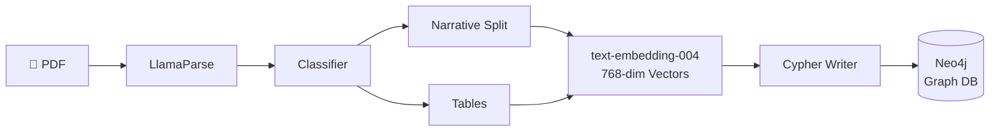
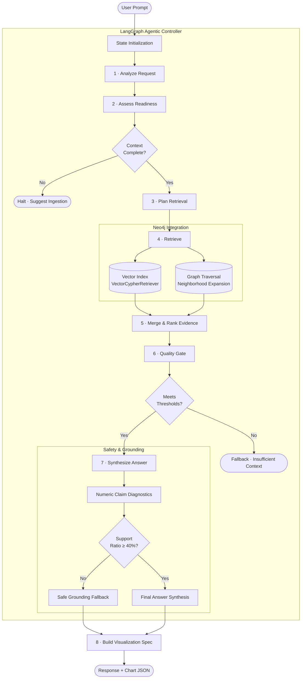
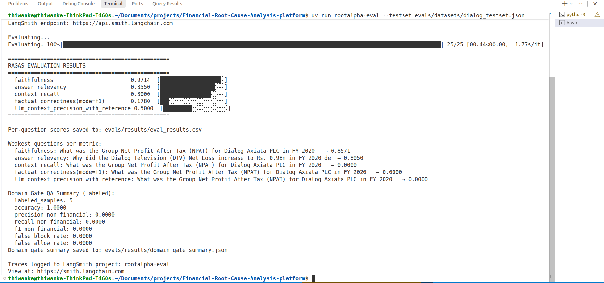

<div align="center">

# RootAlpha

**Multi-Agent GraphRAG Platform for Financial Root-Cause Analysis**

[](https://python.org)
[](https://langchain-ai.github.io/langgraph/)
[](https://smith.langchain.com)
[](https://neo4j.com)
[](https://cloud.google.com/vertex-ai)
[](https://docker.com)
[](LICENSE)
[](https://youtu.be/uc_bf1roLrs?si=Tusse26CBd6SNBsB)

Ingests quarterly reports → builds a causal knowledge graph → returns numerically-verified root-cause analysis in under **15 seconds**.

🎬 **[Watch the 5-Minute Demo Video on YouTube](https://youtu.be/uc_bf1roLrs?si=Tusse26CBd6SNBsB)**

</div>

---

## Overview

Every quarter, financial analysts spend hours manually cross-referencing dense, 120-page quarterly reports to understand the drivers behind margin compressions, revenue misses, and balance sheet shifts. While generic AI tools exacerbate this by hallucinating numbers and missing cross-section connections, **RootAlpha** automates financial root-cause analysis in seconds by reading reports like a senior analyst. By isolating tables and building a causal knowledge graph (linking metrics to events, event risks, and macro conditions), RootAlpha maps cause-and-effect relationships explicitly, providing interactive page citations and strictly hard-blocking any numeric claims that cannot be mathematically verified against the source text.

---

## Architecture

RootAlpha runs in two stages: an **asynchronous document ingestion pipeline** that extracts tables and constructs the knowledge graph in Neo4j, and a stateful **LangGraph query agent** that executes hybrid retrieval (vector search + Cypher graph traversal), validates response quality, and verifies numeric claims.

### ☁️ Cloud Architecture


### 📄 Ingestion Pipeline


### 🤖 Query Agent State Machine


---

## Tech Stack

* **Agent Orchestration**: LangGraph, LangChain
* **Graph Database**: Neo4j Enterprise (APOC, Vector Index, `VectorCypherRetriever`)
* **LLMs & Embeddings**: Google Vertex AI (`gemini-2.5-flash`, `text-embedding-004`)
* **PDF Parsing**: LlamaParse (layout classification, table isolation)
* **Backend API**: Python 3.11, FastAPI, Uvicorn
* **Frontend UI**: React, Vite, Tailwind CSS, Recharts
* **Testing & DevOps**: Docker Compose, Pytest, Ruff, Mypy, LangSmith, Phoenix

---

## Evaluation

RootAlpha enforces anti-hallucination at the numeric level. If fewer than **40%** of generated numeric claims are traceable to retrieved context, the system hard-blocks and returns a safe grounding fallback.

Below is the execution output of the automated Ragas evaluation suite:



---

## Quick Start

### Prerequisites
* Docker & Docker Compose
* `gcloud` CLI (authenticated with a project hosting Vertex AI APIs)
* LlamaParse API Key

### Deploy with Docker (Recommended)
```bash
# 1. Clone the repository
git clone https://github.com/your-username/financial-root-cause-analysis.git
cd financial-root-cause-analysis

# 2. Configure environment
cp .env.example .env
# Set GCP_PROJECT_ID and LLAMA_PARSE_API_KEY in .env

# 3. Authenticate Google Application Default Credentials (ADC)
gcloud auth application-default login --project your-gcp-project-id

# 4. Spin up containerized microservices
docker-compose up --build
```

| Service | Local URL |
|---|---|
| LangGraph Agent UI | http://localhost:8080 |
| FastAPI Ingestion Docs | http://localhost:8000/docs |
| Neo4j Browser | http://localhost:7474 — `neo4j` / `password123` |

---

## Key Design Decisions

* **Neo4j Graph Database**: Replacing traditional vector stores with a knowledge graph allowed explicit representation of causal connections (`CAUSED`, `IMPACTED`, `DEPENDS_ON`), resolving multi-document root-cause tracing issues.
* **Stateful LangGraph Agent**: Using a state-machine framework enables cyclic correction and fallback routing (like triggering quality gate re-runs or requesting user input), which is impossible with linear chains.
* **Numeric Guardrails**: Injecting regex-based validation of generated numbers against raw source context guarantees strict grounding for high-stakes financial analysis.