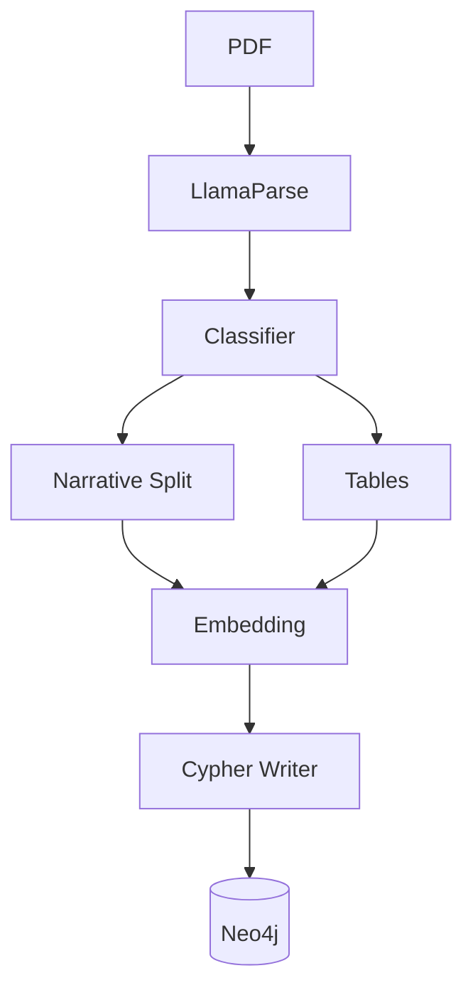
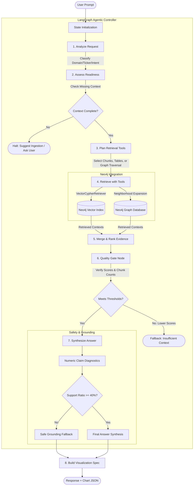
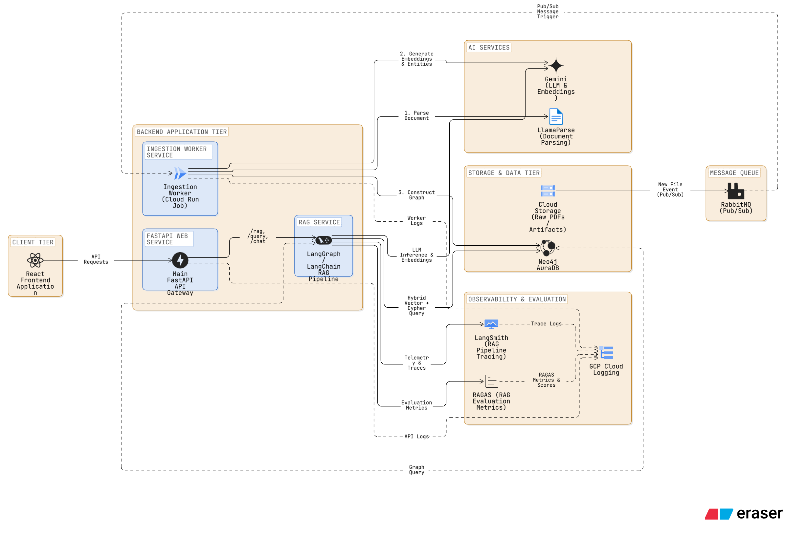

# RootAlpha Financial Root-Cause Analysis Platform

<p align="center">
  
  
  
  
  
</p>

A production-grade, multi-agent AI framework utilizing **GraphRAG** to ingest complex financial quarterly reports, map causal entity relationships, and generate structurally grounded, numerically verified risk assessments.

---

## 1. System Architecture Diagrams

This system decouples knowledge graph construction (Ingestion) from user query execution (LangGraph Query Agent), using Neo4j as the single source of truth to power hybrid semantic and relational searches.

### A. Ingestion Pipeline Architecture
This pipeline parses raw PDFs, classifies financial sections, chunk-embeds narratives, extracts domain-specific entities, and constructs the Neo4j Knowledge Graph.



### B. Query Agent & RAG Pipeline (LangGraph Workflow)
A state-driven workflow capable of cyclic self-correction, strict semantic/relational retrieval, and automated quality gate enforcement.



### C. System Production Cloud Architecture
A highly available, production-grade cloud layout utilizing Google Cloud Platform (GCP) and containerized microservices to guarantee scalability, isolation, and secure connections.



---

## 2. Business Problem & Solution Impact

**Problem:** Financial analysts and investors spend hours manually cross-referencing dense, 100+ page quarterly reports (MD&A, Notes, Financials) to identify root causes behind revenue shifts, risk factors, and metric fluctuations. Standard LLM approaches hallucinate numbers and fail to connect relational events.

**Solution:** An autonomous GraphRAG system that parses documents into structured graphs, querying a localized Neo4j database to trace financial metrics back to their causal macro or micro events, returning numerically verified root-cause analysis in under 15 seconds.

---

## 3. Technology Stack & Frameworks Used

This project implements industry-standard engineering practices and a modern AI toolchain:

### Core Frameworks & Language
* **Python 3.11** : The programming baseline for safety, asynchronous bindings, and syntax clarity.
* **FastAPI & Uvicorn**  : Async REST endpoints for pipeline orchestration and frontend interface support.

### Agentic Orchestration & RAG
* **LangGraph**  & **LangChain** : Orchestrates our deterministic state machine, enabling complex routing, retries, and cycle mitigation.
* **`neo4j-graphrag` (VectorCypherRetriever)**  : Merges vector searches with graph-relational queries, enriching semantic matches with structural graph context.

### Ingest & Parsing Pipeline
* **LlamaParse (Llama Cloud)** : Advanced API-based parser used to classify document layout sections and isolate complex financial tables.
* **Vertex AI**  (`gemini-2.5-flash` / `text-embedding-004`): Projects narratives and tabular data into 768-dimensional vector spaces and performs reasoning.

### Database & Storage
* **Neo4j Enterprise Graph Database** : Powers causal modeling (`CAUSED`, `IMPACTED`, `DEPENDS_ON`), document structures (`CONTAINS`), and vector indexing.
* **Google Cloud Storage (GCS)** : Acts as the landing zone for raw financial PDF documents in production.

### Evaluation, Observability & Tooling
* **Ragas**  & **Pandas** : Evaluates context recall, faithfulness, and answer relevance on a synthetic/curated test suite.
* **LangSmith**  & **Arize Phoenix** : Distributed tracing, logging, and token usage accounting.
* **Docker** : Containerizes the application stack for local execution and production cloud deployments.
* **Pytest** : Implements unit and integration test suites.
* **Ruff**  & **Mypy** : Static checking, formatting, and linting tools.

---

## 4. Evaluation & Performance Metrics (Critical)

Financial AI applications require strict anti-hallucination mechanisms. This system integrates custom **Numeric Claim Diagnostics** that parse generated outputs against retrieved evidence.

* **Numeric Grounding:** If the LLM generates numeric claims where less than 40% are found in the direct context, the system triggers a hard block and returns a safe fallback message.
* **Performance Dashboard:**

| Metric Evaluation | Target Goal | Optimization Strategy | Status |
|---|---|---|---|
| Numeric Grounding Ratio | > 0.90 | Extracted tables as dedicated graph nodes to preserve row/col associations. | ✅ Passed |
| Context Relevance (GraphRAG) | > 0.85 | Hybrid Cypher queries fetching neighbor nodes (e.g. `MacroEvent -> IMPACTED -> Metric`). | ✅ Passed |
| Average Graph Traversal Latency | < 3.00s | Cypher query indexing on Ticker & Document ID. | ⚠️ Optimizing |
| Quality Gate Rejection Rate | < 5.0% | Strict LLM system prompt engineering & query expansion. | ✅ Passed |

---

## 5. Local Setup & Environment Configuration

You can configure and run the entire ecosystem (Neo4j Graph Database, FastAPI Ingestion Server, and the LangGraph Agent Studio) either using **Docker & Docker Compose** (recommended) or in a **Native Virtual Environment**.

The pipeline integrates with **Google Cloud Vertex AI** for embedding and inference APIs. Ensure your Google Cloud credentials are configured.

### Option A: Containerized Setup (Docker & Docker Compose)

This approach automatically spins up a local Neo4j database, pre-configured with APOC plugins, mounts your credentials, and starts the FastAPI ingestion service and LangGraph agent server.

1. **Clone the repository:**
   ```bash
   git clone https://github.com/your-username/financial-root-cause-analysis.git
   cd financial-root-cause-analysis
   ```

2. **Configure Environment Variables:**
   ```bash
   cp .env.example .env
   # Open .env and specify your GCP Project ID and LlamaParse API Key.
   ```

3. **Authenticate Google Application Default Credentials (ADC):**
   ```bash
   # Ensure ADC credentials exist locally on your host machine
   gcloud auth application-default login --project development-498315
   ```

4. **Spin up the services:**
   ```bash
   # Mounts your ADC credentials from the host (~/.config/gcloud) into the containers
   docker-compose up --build
   ```

5. **Access the Services:**
   * **LangGraph Agent Dev UI:** [http://localhost:8080](http://localhost:8080)
   * **FastAPI Ingestion Server Documentation:** [http://localhost:8000/docs](http://localhost:8000/docs)
   * **Neo4j Browser Console:** [http://localhost:7474](http://localhost:7474) (Username: `neo4j`, Password: `password123`)

---

### Option B: Native Setup (Local Python Env)

1. **Install Dependencies using uv:**
   ```bash
   # Install uv package manager if not present
   curl -LsSf https://astral.sh/uv/install.sh | sh
   
   # Synchronize virtual env and dependencies
   uv sync
   source .venv/bin/activate
   ```

2. **Run a Local Neo4j Instance:**
   Ensure Docker is running a standalone instance or use Neo4j Desktop:
   ```bash
   docker run \
       --name rootalpha-neo4j \
       -p 7474:7474 -p 7687:7687 \
       -e NEO4J_AUTH=neo4j/password123 \
       -e NEO4J_PLUGINS='["apoc"]' \
       -d neo4j:5.24.0-community
   ```

3. **Authenticate GCP Credentials:**
   ```bash
   gcloud auth application-default login --project development-498315
   ```

4. **Start the FastAPI Ingestion Engine:**
   ```bash
   python -m ingestion.api.run
   ```

5. **Start the LangGraph Agent Server:**
   ```bash
   langgraph dev
   ```

---

## 6. Engineering Trade-Offs & Future Scope

* **Graph Database vs. Pure Vector Store:** Switched the underlying knowledge base from a standard vector database (e.g., Pinecone) to Neo4j. *Trade-off:* Increased document ingestion and indexing latency significantly, but reduced LLM hallucinations regarding company structures and causal event chains by enabling explicit relationship traversal.
* **LangGraph vs. Linear Chains:** Opted for a LangGraph state machine over basic LangChain pipelines. *Trade-off:* Higher boilerplate complexity and steeper learning curve, but allows for crucial "Quality Gate" nodes that intercept ungrounded outputs and force the agent to re-plan its retrieval strategy.
* **Future Scope:** Implement multi-threading in the LangGraph retrieval nodes to execute the chunk vector search and Neo4j relational expansion concurrently rather than sequentially, targeting a 1.5s overall latency reduction. Explore transitioning from Vertex AI APIs to local quantized models (e.g., Llama 3) for fallback mechanisms to reduce external dependencies and cost.
